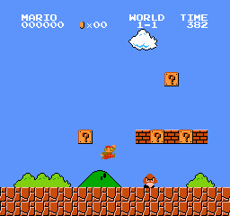

# Mario Reinforcement Learning Model

This document outlines the development and implementation of a reinforcement learning model for playing the classic game "Super Mario Bros." The model is built using Jupyter Notebook and utilizes the following libraries: gym, PyTorch, and stable-baselines3.



## Introduction

Reinforcement Learning (RL) is a type of machine learning that allows an agent to learn from interacting with an environment. In this project, we aim to train an RL agent to play "Super Mario Bros." effectively, using the OpenAI Gym library to interface with the game environment and the stable-baselines3 library for RL algorithms.

## Environment Setup

To begin, we need to install the required libraries. Assuming you have Python installed, run the following commands in your terminal or command prompt:

```bash
pip install gym
pip install torch
pip install stable-baselines3
```
## How to use the Notebook
Follow the jupyter notebook and try to run the model yourself. The models are too large to be uploaded to github, However, the mario trained using the above code with enough time steps was able to beat the first level.

## Conclusion
In this project, I successfully trained a reinforcement learning model using PPO to play "Super Mario Bros." The model's performance can be further improved by tuning hyperparameters, trying different RL algorithms, or using more sophisticated observation preprocessing techniques.
